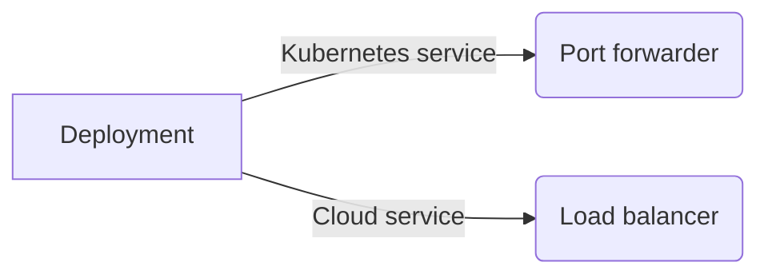

# K8s Cluster Guard

 **K8s Cluster Guard** is an intricate opensource and free Velero Backup management solution.
 Deploying a low footprint Kubernetes deployment/pod and option service.
Two deployment scenarios are available:

>Port forwarder
Load balancer

# Instructions

Please see the following website for detailed instructions and best practices.
https://www.badgoblin.co.uk

# Files
Download the following files depending on your requirements.
- Port-forwarding solution
https://github.com/mybadgoblin/kcg/blob/main/kcg.yaml

- Load balancer solution
https://github.com/mybadgoblin/kcg/blob/main/kcg-lb.yaml

## Connection options
As described previously, the following options are available.

## Release history
The following releases have been produced

|          Date      |Version                          |Comments                         |
|-----------------------|----------------------------------|--------------------------------|
|7th December 2023     |    v10.0  |Initial version

